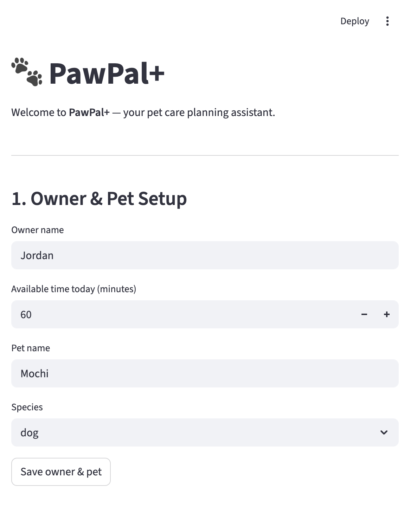
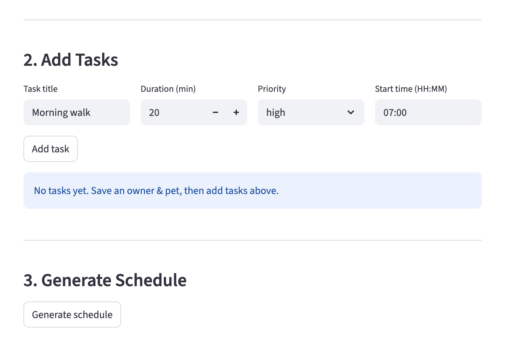

# PawPal+ — Pet Care Planning Assistant

**PawPal+** is a Streamlit app that helps busy pet owners stay consistent with daily pet care. It lets you define tasks, set priorities and time constraints, and generate a smart daily schedule — with conflict warnings and automatic recurrence built in.

---

## Table of Contents

1. [Scenario](#scenario)
2. [Features](#features)
3. [Project Structure](#project-structure)
4. [Getting Started](#getting-started)
5. [How to Use the App](#how-to-use-the-app)
6. [Scheduling Logic](#scheduling-logic)
7. [Running Tests](#running-tests)

---

## Scenario

A busy pet owner needs help staying consistent with pet care. They want an assistant that can:

- Track care tasks (walks, feeding, medication, grooming, enrichment, etc.)
- Consider constraints like available time, task priority, and preferred schedule times
- Produce a daily plan and explain why each task was chosen or skipped

---

## Features

- **Priority-based scheduling** — tasks are ranked `HIGH > MEDIUM > LOW` using a Python `Enum`. The scheduler greedily fills the owner's daily time budget with the highest-priority tasks first.
- **Sorting by time** — tasks are always displayed in chronological order by preferred start time (`HH:MM`), regardless of the order they were added.
- **Conflict warnings** — the scheduler checks every pair of tasks per pet for overlapping time windows and surfaces human-readable warnings in the UI. Conflicts are flagged but do not block the schedule, leaving the final decision to the owner.
- **Daily and weekly recurrence** — when a recurring task is marked complete, the next occurrence is automatically created using Python's `timedelta` (`+1 day` for `"daily"`, `+7 days` for `"weekly"`). One-off tasks (`"as needed"`) complete without spawning a follow-up.
- **Filtering** — tasks can be filtered by completion status or pet name, making it easy to see only what still needs to be done.
- **Multi-pet support** — an owner can have multiple pets, each with their own independent task list. The scheduler aggregates across all pets when generating a plan.
- **Persistent UI state** — Streamlit's `session_state` keeps the owner, pets, and tasks in memory across button clicks so no data is lost on page rerun.

---

## Project Structure

```
pawpal-starter/
├── app.py               # Streamlit UI — connects the interface to the logic layer
├── pawpal_system.py     # Logic layer — all classes and scheduling algorithms
├── main.py              # Terminal demo — run to verify logic without the UI
├── requirements.txt     # Python dependencies
└── tests/
    └── test_pawpal.py   # Pytest tests for core scheduling behaviors
```

---

## Getting Started

### Prerequisites

- Python 3.10+
- pip

### Setup

```bash
python -m venv .venv
source .venv/bin/activate        # Windows: .venv\Scripts\activate
pip install -r requirements.txt
```

### Run the app

```bash
streamlit run app.py
```

### Run the terminal demo

```bash
python main.py
```

### 📸 Demo
<a href="/images/app_screenshot_1.png" target="_blank"></a>.

<a href="/images/app_screenshot_2.png" target="_blank"></a>.

---

## How to Use the App

The app is organized into three sections:

### 1. Owner & Pet Setup
Enter your name, how many minutes you have available today, and your pet's name and species. Click **Save owner & pet** to initialize the session.

### 2. Add Tasks
Fill in the task title, duration, priority, and preferred start time, then click **Add task**. Tasks appear in a table sorted chronologically. If any two tasks overlap in time, a conflict warning is shown immediately below the table.

### 3. Generate Schedule
Click **Generate schedule** to run the scheduler. The app displays:
- A table of **scheduled tasks** with their start and end times
- A list of **skipped tasks** that did not fit within the available time budget
- Any **conflict warnings** are re-surfaced at this step so they are not missed

---

## Scheduling Logic

The scheduler (`Scheduler` in `pawpal_system.py`) uses the following algorithms:

| Method | Description |
|---|---|
| `generate_plan()` | Greedy algorithm — sorts pending tasks by priority (`HIGH` first), then fits them into the time budget one by one until no more fit |
| `sort_by_time()` | Sorts tasks by `HH:MM` start time using a lambda key on string comparison |
| `filter_tasks()` | Filters a task list by `completed` status and/or `pet_name` |
| `detect_conflicts()` | Checks all task pairs per pet for overlapping windows using interval overlap logic: conflict if `a_start < b_end AND b_start < a_end` |
| `mark_task_complete()` | Marks a task done; if `frequency` is `"daily"` or `"weekly"`, auto-creates the next occurrence via `Task.next_occurrence()` using `timedelta` |

### Design tradeoff

The scheduler uses a **greedy algorithm** rather than an optimal packing approach (like 0/1 knapsack). This guarantees that the most critical tasks always run first, which is the right default for pet care — a `HIGH` priority medication should never be dropped in favor of fitting two `LOW` tasks. If the plan isn't ideal, the owner can adjust task durations or priorities directly.

---

## Running Tests

```bash
python -m pytest tests/test_pawpal.py -v
```

The test suite covers:

- Task completion and status changes
- Adding tasks to a pet
- Sort order correctness
- Daily and weekly recurrence date calculation
- `"as needed"` tasks completing without recurrence
- Conflict detection for overlapping and same-start-time tasks
- No false positives on sequential (non-overlapping) tasks
- Empty pet producing an empty plan
- Task exactly filling the time budget (boundary condition)
- Task exceeding the time budget being skipped
